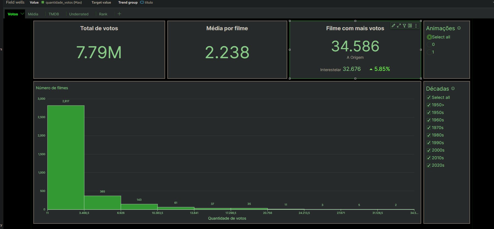
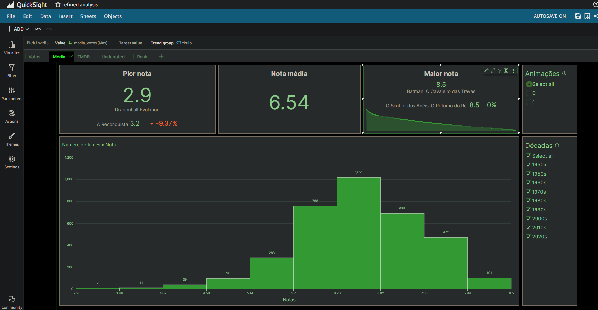

# __Eduardo Takeshi Voltareli Suzuki__&emsp;[](https://www.credly.com/badges/f8e11b75-be6b-4d5a-bbdf-78b26461a906/public_url) [](https://www.credly.com/badges/f5d18173-ec8b-4eb8-aa3b-40851b614eca/public_url) [](https://www.credly.com/badges/6e6f5deb-30a2-48d8-9246-3de1c929f3aa/public_url) [](https://www.credly.com/badges/e726261c-d0c3-48ea-b48e-8da091a6f318/public_url) [](https://www.credly.com/badges/73680355-70fe-4faa-8694-5c88804fbdf2/public_url)
[eduardo.suzuki.pb@compasso.com.br](mailto:eduardo.suzuki.pb@compasso.com.br)&emsp;&emsp;&emsp;&emsp;&emsp;&emsp;&emsp;&emsp;&emsp;&emsp;&emsp;&emsp;&emsp;&emsp;&emsp;&emsp;&emsp;&emsp;&emsp;&emsp;&emsp;&emsp;&emsp;&emsp;&emsp;&emsp;&emsp;&emsp;&emsp;&emsp;[](https://www.linkedin.com/in/eduardo-suzuki888/) 
[eduardo.suzuki8@hotmail.com](mailto:eduardo.suzuki8@hotmail.com) 
#

Saudações, sou estudante de Sistemas de Informação na UTFPR, sede de Curitiba, onde também moro, e atualmente estou no 6º período. Originalmente venho do interior de São Paulo, cidade de Presidente Prudente, onde cursei brevemente Ciência da Computação pela UNESP de lá.

Há algum tempo já venho tendo interesse na área de análise/ciência/engenharia de dados e à procura de uma oportunidade de estágio relacionado, inclusive cursando uma matéria optativa de introdução a ciência de dados ofertada pela universidade.

Já tive experiência com _python_ em um estágio anterior, onde era responsável tanto pelo desenvolvimento quanto a execução de testes automáticos(_robot framework, pywinauto, requests_, etc.). 

Gosto de jogar online, conversar com amigos no discord e ocasionalmente editar vídeos. [Aqui](https://www.youtube.com/watch?v=ewrH-qLSbXs) vai um exemplo de um vídeo que editei como um trabalho da faculdade.

## :runner: __Sprint 1__:

Durante esta primeira _sprint_ fui o líder da _squad_ 5. Procurei demonstrar iniciativa no quesito de discussão sobre o material passado, propus reunirmos antes das _dailies_ para tirarmos dúvidas de uns aos outros, acompanhar o progresso de cada um, e passar um pouco da experiência que tive pois já havia usado as tecnologias passadas em um estágio anterior.

#### :rugby_football: SCRUM:

Como mencionado, no estágio anterior já tive experiência com _scrum_, assim como nas _dailies_ desta primeira sprint, participando de reuniões diárias relatando o progresso e eventuais problemas que impediam ou postergavam a evolução das _tasks_ e/ou estudos. O curso ajudou a esclarecer melhor as responsabilidades do _**Product Owner**_ e _**Scrum Master**_.

1. **Product Owner**:

    1. Administrar e priorizar o _backlog_ do produto.
    2. Entender o mercado e as necessidades do cliente.
    3. Traduzir as estratégias do(s) _product manager(s)_ em _user stories_ para que possam se definir em _tasks_ para o time de desenvolvimento.
    4. Avaliação de testes e se os resultados atingem o objetivo esperado.
    <br>
    No geral, se responsabilizar pelo relacionamento entre produto e desenvolvimento.
    <br>

2. **Scrum Master**:

    1. Acompanhar e facilitar o progresso do time de desenvolvimento.
    2. Avaliar e adaptar aos impedimentos ou dificultadores no desenvolvimento do projeto.
    3. Organizar e avaliar as _tasks_ de maior prioridade.

    <br>

#### :octocat: **Git e Github**:

Como também mencionado, já estava familiarizado com o básico do _git_, e já o utilizo para armazenar arquivos _config_ e projetos da universidade. Aproveitei para dar uma revisada no conteúdo e aprender mais sobre a tecnologia, principalmente da seção 4 em diante, o conceito de _submodules_, _logs_ mais detalhados, _markdown_ e boas práticas em geral. 

Um exemplo de comandos utilizados para inicializar este repositório:

```
git init
git remote add compass_uol https://github.com/Z1g0t0/compass_uol
git add .
git commit -m "Primeiro commit"
git push
```

#### :penguin: **Linux**:

Também já estava familiarizado com os comandos de _linux_, conceitos relacionados a arquivos e diretórios, permissões, e comandos relacionados a rede. Possuo um _notebook_ com _ubuntu_ instalado e sempre gostei do editor _vim_ junto com _tmux_ desde o primeiro contato que tive e é o que eu sempre utilizo para programar. 

Um exemplo de comandos utilizados na criação deste repositório:
```
mkdir -p compass_uol
cd compass_uol
vim README.md
```

E caso não saibam _**:x**_ para salvar e sair do _vim_ :sweat_smile:

## :runner: __Sprint 2__:

#### :outbox_tray: **SQL**

_Structured Query Language_, ou _SQL_, é uma linguagem estruturada para realizar consultas aplicadas em base de dados, para a geração de tabelas as quais podem ser extraídas informações que podem agregar valor à diversas análises, como _trends_, padrões, estatisticas, visualizações, etc.

Um exemplo de _query_ realizada para extrair a tabela _Export_1_, encontrada na pasta _Export_ usando a base de dados _biblioteca.sqlite_:

```
with livros as(
    select cod, titulo, valor, nome, codeditora, autor
    from livro 
    left join editora on 
        livro.editora = editora.codeditora
)

select cod as CodLivro, titulo as Titulo, codautor as CodAutor, autor.nome as NomeAutor, valor as Valor, codeditora as CodEditora, livros.nome as NomeEditora
from livros 
left join autor on 
    livros.autor = autor.codautor
order by valor desc
limit 10
```

#### :bar_chart: **Big Data**

Com a geração de dados cada vez maior dia após dia, é necessário entender os conceitos usados para o armazenamento, os profissionais responsáveis por cada função de análise de dados e o funcionamento de computação em _cloud_.

Exemplo de conceitos vistos para armazenamento de dados:

##### :office: _**Data Warehouse**_

Sistema de armazenamento de dados com um _schema_ predefinido, porém podendo receber dados de diferentes fontes, voltado para suportar decisões de negócio.

##### :sunrise: _**Data Lake**_

Armazenamento de dados estruturados e não estruturados, na sua forma bruta, sem um _schema_ predefinido, podendo receber qualquer tipo de dado.

##### :inbox_tray: _**Data Store**_

Armazenamento de dados com um fim especifico, podendo receber dados de formatos variados, relacionados a uma categoria determinada.

## :runner: __Sprint 3__:

#### :snake: **Python**

Como também mencionado, já estava familiarizado com _python_ devido a um estágio anterior, usei o conteúdo da udemy para revisar os conceitos de programação orientada a objetos, como classes, herança, herança múltipla, etc.

Um exemplo de herança múltipla usando classes:

```
class Azul:
    rgBLUE = '0000FF'

class Vermelho:
    REDgb = 'FF0000'

class Roxo( Azul, Vermelho ):
    REDgBLUE = 'FF00FF'

if __name__ == '__main__':
    roxo = Roxo()
    print(f'Azul: {roxo.rgBLUE}, Vermelho: {roxo.REDgb}, Roxo: {roxo.REDgBLUE}')
```

## :runner: __Sprint 4__:

#### :curly_loop: **Python Funcional**
Como continuação da _sprint_ anterior, foi visto o paradigma funcional e as ferramentas que o _python_ oferece sobre, sendo visto métodos como _map_, _filter_, _reduce_, entre outros, que possibilitam solucionar problemas de maneira enxuta, sofisticada e com outra maneira de se pensar/programar.

Como exempo, a solução do exercício 2 feito na _sprint_, implementando uma função que conta as vogais de uma _string_ ou texto:

```
def conta_vogais(texto:str)-> int:

    vogais = ['a', 'e', 'i', 'o', 'u', 'A', 'E', 'I', 'O', 'U']
    
    count = filter(lambda x: x in vogais, texto)
    
    return len(list(count))
```

#### :whale: **Docker**
Assim como _python_ funcional, pode-se dizer que docker também oferece um paradigma diferente de virtualização, com a execução de programas e/ou sistemas a partir da contrução de uma imagem, com as informações e instruções necessária pré-determinadas, onde estas são executadas em containers, que seriam ambientes isolados tendo o que for necessário para a execução da imagem.

Um exemplo de _Dockerfile_ usado no exercício da _sprint_, que executa um _script_ _python_ "_hash.py_":

```
FROM python

WORKDIR /test

COPY hash.py .
CMD ["python", "hash.py"]
```

E o comando para construir e executar a imagem:

```
docker build -t mascarar-dados .
docker run -it mascarar-dados
```

Vale lembrar em verificar se o serviço do _docker_ está rodando :sweat_smile:

#### :chart_with_downwards_trend: **Estatística Descritiva com Python**

Como já havia cursado a matéria de probabilidade e estatística com a didática muito parecida com a do curso, usei os vídeos como revisão dos conceitos gerais, como o de variância, desvio padrão, método de monte carlo, etc.

## :runner: __Sprint 5__:

Durante esta _sprint_ foi o primeiro contato com os princípios e conceitos que se baseiam a AWS(_Amazon Web Services_), assim como a execução de tarefas práticas com suas ferramentas e seus respectivos serviços. Principais tecnologias AWS abordados durante esta _sprint_ foram:

#### :left_right_arrow: Elastic Compute Cloud (EC2):
Amazon EC2 permite uma melhor eficiência no uso de recursos sob demanda de processamento, possibilitando aumentar ou diminuir a escalabilidade conforme a necessidade, com diversas opções de configuração para _hardware_(memória, armazenamento, processador, etc.) e para _software_(sistema operacional, _drivers_, etc.)

#### :symbols: Simple Storage Service (S3):
Serviço para armazenamento de dados orientado a objetos, de alta disponibilidade, segurança, performance e escalabilidade, oferencendo uma variedade de tipos de classes para diversos casos de uso, com ferramentas de gerenciamento de armazenamento, acesso, processamento, monitoramento, etc.

#### :repeat: Relational Database Service (RDS):
Serviço para base de dados relacionais, oferecendo facilidade para criação, operação e escalabilidade, com compatibilidade a outras _engines_ de base de dados como _MySQL_, _PostgreSQL_, _Oracle's DBMS_, entre outros.

#### :twisted_rightwards_arrows: Virtual Private Cloud (VPC):
Serviço de rede virtualmente isolada para execução de outros serviços e recursos AWS, facilitando a organização e administração de roteamento, endereçamentos IP, _peering connections_ para tráfego entre duas VPCs, etc.

#### :left_luggage: Identity Access Management (IAM):
Serviço para gerenciamento de permissões e controle de acesso de usuários a determinados recursos AWS, podendo ser acessado através da _AWS's Management Console_, _Command Line Tools_ ou suas SDK's (_Software Development Kits_).

## :runner: __Sprint 6__:
Foram apresentados muito mais serviços AWS, desta vez mais voltados para a área de análise de dados, serviços estes como _Kinesis_, _Athena_, _QuickSight_, _Redshift_, _IoT Analytics_, entre outros. Um pouco das funções de alguns deles são:

#### :surfer: Amazon Kinesis:
Serviço para processamento de dados em larga escala em tempo real, que podem ser oriundos de diversas fontes, inclusive outros serviços, entregando dados para análise mais rapidamente.

#### :statue_of_liberty: Amazon Athena:
Serviço que permite fazer consultas _SQL_ de forma interativa, sendo _serverless_, é uma maneira convencional e simples de se extrair os dados.

#### :mag: Amazon Quicksight:
Serviço orientado a _business intelligence_ para construção de _dashboards_ interativos que oferecem _insights_ para melhor informar e suportar decisões sobre algum produto/serviço sendo analisado, tendo a opção de se utilizar _machine learning_ dentro de seus _insights_.

#### :red_circle: Amazon RedShift:
Um dos principais serviços AWS, orientado para processamento e análise de grande quantidade de dados complexos, ou seja, podendo ser semi-estruturados, sendo assim uma solução de _big data_ para _data warehouses_.


## :runner: __Sprint 7__:
A partir desta _sprint_ começa a ser feito o desafio final, com o objetivo de apresentar um _dashboard_ interativo com a análise feita sobre o tema relacinado a filmes e séries de um determinado gênero estabelecida para cada _squad_, sendo a _squad_ 5 os gêneros de ação/aventura. 

Também foi introduzido o _PySpark_, API _python_ para o _apache spark_, sendo uma ferramenta extremamente rápida para engenharia e análise de grande quantidade de dados.

Como primeira etapa do desafio, foi proposto uma atividade de ETL(_extraction, transform and load_) em _python_ com alguns arquivos para serem carregados em um _bucket_ S3, utilizando a biblioteca _boto3_, particionados por estágio da extração, data, tipo do arquivos, etc. O código ficou:

```
import boto3
import datetime
import os

if __name__ == '__main__':

    current_time = datetime.datetime.now()
    year = current_time.year
    month = current_time.month
    day = current_time.day

    key_id = os.getenv('AWS_ACCESS_KEY_ID')
    secret = os.getenv('AWS_SECRET_ACCESS_KEY')

    s3_client = boto3.client('s3',
                             aws_access_key_id=key_id,
                             aws_secret_access_key=secret)

    response_1 = s3_client.upload_file(r'./movies.csv', 'data-lake-do-eduardo', f'Raw\Local\CSV\Movies\{year}\{month}\{day}\movies.csv')
    response_2 = s3_client.upload_file(r'./series.csv', 'data-lake-do-eduardo', f'Raw\Local\CSV\series\{year}\{month}\{day}\series.csv')

    #print(f'RESPOSTA 1: {response_1} \n')
    #print(f'RESPOSTA 2: {response_2} \n')

```

## :runner: __Sprint 8__:

_Sprint_ composta por atividades práticas, voltadas a progressão do desafio e exercícios de _pyspark_. Foi desenvolvido uma ingestão de dados a um _data lake_ a partir de _requests_ por uma API escolhida. Não decidi exatamente como será meu tema, mas resolvi extrair dados de votação dos filmes a partir da API oferecida pelo site sugerido TMDB(_The Movie DataBase_). Um exemplo de código para requisitar dados da API e salvar em um arquivo csv:

```
import requests
import pandas as pd

api_key = "***"

url = f"https://api.themoviedb.org/3/movie/top_rated?api_key={api_key}&language=pt-BR"

response = requests.get(url)
data = response.json()

filmes = []

for movie in data['results']:
    df = {
        'Titulo': movie['title'],
        'Sinopse': movie['overview'],
        'Votos': movie['vote_count'],
        'Media': movie['vote_average']
    }

    filmes.append(df)

df = pd.DataFrame(filmes)
#df.head()
df.to_csv('out.csv')
```

## :runner: __Sprint 9__:
Estudou-se como fazer modelagem de dados de duas maneiras: relacional e dimensional, aplicando-as nos dados coletados para o desafio na(s) etapa(s) anterior(es). Um resumo de ambas abordagens:

#### :ballot_box_with_check: Modelagem Relacional:
Trata-se de organizar os dados de priorizando a integridade, consistencia e precisão, normalizando os dados proceduralmente nas estabelecidas formas normais. De maneira resumida as 3 primeiras formas normais seriam: 
<br>
<br>
&emsp;&emsp;<ins>Primeira Forma Normal</ins>: Evitar/separar repetições iguais de atributos ou grupo de atributos.
<br>

&emsp;&emsp;<ins>Segunda Forma Normal</ins>: Evitar/separar atributos com dependências parciais, isto é, atributos que não dependem diretamente da chave primária.
<br>

&emsp;&emsp;<ins>Terceira Forma Normal</ins>: Evitar/separar atributos que indiretamente dependem da chave primária, isto é, atributos que dependem da chave de primária por meio de outros atributos.

#### :arrow_up_down: Modelagem Dimensional:
Organiza-se os dados priorizando consultas e análises, classificando os dados de maneira objetiva e quantitativa, com fatos e contextos/dimensões, a fim de informar à análise sobre a situação corrente, possíveis _trends_, correlações, padrões, etc. Um exemplo de criação de um fato a partir da base de dados _concecionaria.sqlite_, disponibilizada como _resource_:

```
create view fato_conta as
    select distinct idCliente, idVendedor, vlrDiaria, qtdDiaria, vlrDiaria * qtdDiaria as total 
    from tb_locacao
```

## :runner: __Sprint 10__:
_Sprint_ da entrega final do desafio, sendo um _dashboard_ feito no _QuickSight_, serviço da AWS para visualizações de análises de dados, contendo diversas formas de gráficos, filtros, interações, ações de navegação, entre outras funcionalidades, assim como personalização de cores como um tema aplicado a todo o _dashboard_. Alguns _prints_ dos primeiros painéis do _dashboard_ que construi:

 

## :runner: Agradecimentos
... 